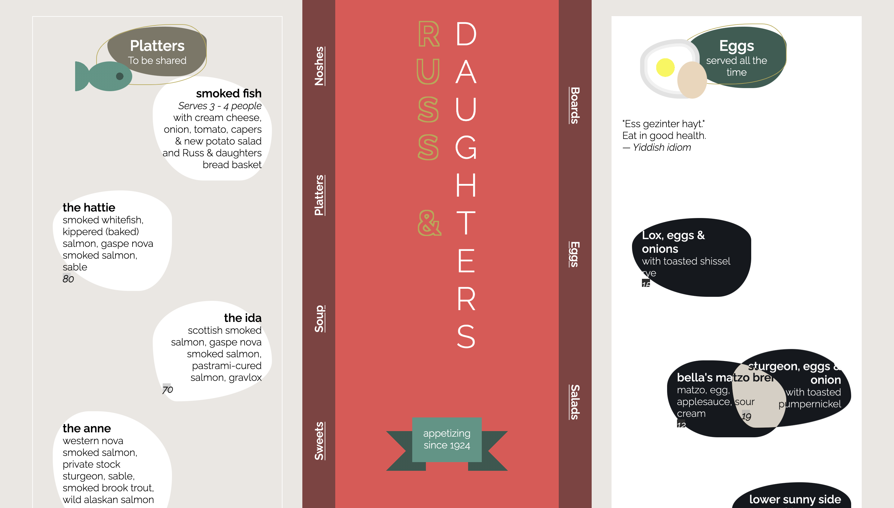

# CSS to the Rescue @cmda-minor-web 2020 - 2021

Voor dit vak ga ik experimenteren met de mogelijkheden voor CSS. Voor de eindopdracht heb ik gekozen voor de menu kaart en ga dit met vanille HTML en CSS maken en mee experimenteren. 

### Uitdagingen
- Blobs/vormpjes maken, met svg, clip-path, gradient of border-radius.
- experimenteren met grid/layout
- animeren met keyframes

## Table of contents

- [Week 1](#Week-1)
- [Week 2](#Week-2)
- [Week 3](#Week-3)
- [Week 4](#Week-4)
- [Eindresultaat en Reflectie op proces 📋](#Eindresultaat-&-reflectie-op-proces:)
- [Bronnen](#Bronnen) 

# Week 1:
In deze week heb ik een keuze gemaakt waar ik mee wil experimenteren, de menu kaart. Ik heb eerst een pinterestbord gemaakt om wat inspiratie op te doen als beginpunt. [Pinterest bord is hier de vinden](https://nl.pinterest.com/sanneduinker/css-to-the-rescue/)

Ik heb gekozen voor nu voor de context: color-schemes en te spelen met de dark mode. 
En ik heb gekozen voor de volgende **restricties**:
- SVG toepassen met mask, shapes en filter
- Responsive zonder media queries

## Eerste schets


# Week 2
2 themasessies gevolgd: vormpjes maken en animeren. Ik heb gespeeld met layout en geprobeerd mijn schets na te maken. Daarnaast heb ik ook blobs gemaakt en uitgeprobeerd met border-radius. Ik heb een blobje geanimeerd met de border-radius en @keyframes.

## Code - Blob en Animation
**Animation**
```

@keyframes blob-move-1 {
    0% {
      border-radius: 45% 92% 40% 62% / 50% 75% 70% 90%;
    }

    25% {
      border-radius: 48% 37% 48% 32% / 41% 32% 61% 45% ;
    }

    50% {
        background-color:  rgb(54, 88, 79);
        border-radius: 80% 60% 40% 90% / 50% 40% 70% 90%;
    }

    75% {
        border-radius: 48% 37% 48% 32% / 41% 32% 61% 45% ;
    }

    100% {
        border-radius: 45% 92% 40% 62% / 50% 75% 70% 90%;
    }
}

section:nth-child(odd) header  {
    background-color: var( --prime-color-blue);
    color: white;
    border-radius: 45% 92% 40% 62% / 50% 75% 70% 90%;
    
    animation-name: blob-move-1;
    animation-duration: 12s;
    animation-iteration-count: infinite;
    animation-timing-function: ease-in-out;
}
```
**Blobs**
```

section:first-of-type article:nth-child(3n + 2){
    background-color:white;
    border-radius: 45% 92% 40% 62% / 50% 75% 70% 90%;
  }

  section:first-of-type article:nth-child(3n + 3){
    background-color:white;
    border-radius: 80% 60% 40% 90% / 50% 40% 70% 90%;
  }

  section:first-of-type article:nth-child(3n + 4){
    background-color:white;
    border-radius: 50% 50% 80% 20% / 40% 60% 40% 60%;
  }
```

## Resultaat deze week:


### Reflectie:
Het maken van de blobs was makkelijker dan gedacht. Hetzelfde geldt voor de animaties. Ik had hier nog niet eerder mee gewerkt maar ik snapte wel snel hoe het werkt. Daarnaast heb ik zelf nog wat gespeeld met de layout en de grid, waar ik geleerd hebt over de grid-area wat handig is om aan een element mee te geven waar in de grid het element start en eindigt. Ik denk zeker dat ik vaker de animatie @keyframes ga gebruiken voor mee interactie en speling in design.


### Uitdagingen volgende week
- Een vormpje maken met SVG, clip-path
- verder animeren
- Met typografie spelen
- banner maken bij appetizing since 1924

# Week 3
Deze week heb ik gespeeld met de svg filter en mijn ontwerp verder uitgewerkt. Ik heb ook de banner uitgewerkt.

## Voortgang

### Banner

Ik had wat issues met de stack volgorde z-index, omdat ik meerdere backgroundcolors had gebruikt binnen mijn header.

```
body > header p::before{
    content: "";
    position: absolute;
    width: 4rem;
    height: 4rem;
    right: 80%;
    top: 30%;
    z-index: -1;
    background-image: 
    linear-gradient(to right top, transparent 50%, rgb(54, 88, 79) 50%),
    linear-gradient(to right bottom, transparent 50%, rgb(54, 88, 79) 50%);
}

body > header p::after{
    content: "";
    position: absolute;
    width: 4rem;
    height: 4rem;
    left: 80%;
    top: 30%;
    z-index: -1;
    background-image: 
    linear-gradient(to left top, transparent 50%, rgb(54, 88, 79) 50%),
    linear-gradient(to left bottom, transparent 50%, rgb(54, 88, 79) 50%);
}
```

### SVG filter:
Ik heb geleerd hoe je filters toepast op svg binnen de html, dat was compleet nieuw voor mij. En je dat in de css daar naartoe linkt.

**HTML:**
```
<svg>
				<defs>
					<filter id="outline-text">
						<!-- feMorphology: om svg te vergroten of te verkleinen, in dit geval met 3 vergroot-->
						<!-- SourceGraphic: source waarop filter wordt toegepast, bijvoorbeeld de span met 'Russ' -->
						<feMorphology in="SourceGraphic" operator="dilate" radius="1.5" result="dilated"/>
							<!-- more info: https://developer.mozilla.org/en-US/docs/Web/SVG/Element/feMorphology -->
						<!-- feComposite: net zoals bij illustrator pathfinder, kan je het snijden-->
						<!-- in="dilated": result van feMorphology in de composite-->
						<feComposite in="dilated" in2="SourceGraphic" operator="out"/>
					</filter>
				</defs>
			</svg>

```

**CSS:**

```
 body > header h1 span:not(:nth-child(4)){
        color: var(--gold);
        filter: url(#outline-text); /* filter in html toegepast */
    }

```

Ik had niet zo heel veel inspiratie meer dus ik had de sessie los met de heupen CSS bijgewoont. Daar kreeg ik goeie tips om een menu te maken en dan wat meer interactie binnen het ontwerp te doen. Met bijvoorbeeld :target. En misschien met clip-path afbeeldingen uit te snijden en dan bij de gerechten te plaatsen. Ook kreeg ik als idee om bij elke groep zoals Noshes een vormpje naast de titel te doen. Of met drop-shadow werken. En misschien om bij de sections dan met de grid het over elkaar te plaatsen.

Hiervanuit had ik een nieuwe schets gemaakt om verder te kunnen met mijn ontwerp: 


En na aanleiding heb ik ook een vormpje via illustrator als svg gemaakt en in de index.html geplaatst. 


## Resultaat deze week:


### Reflectie:
Ik heb gekozen om in plaats van te kiezen voor de context prefers-color-scheme te gaan voor print-stylesheet. Dat leek me interessant omdat ik daar nog niet mee gewerkt hebt. Ik had niet eerder gewerkt met svg filters of filters in het algemeen dus het was compleet niet voor mij. SVG filters vond ik wel lastig omdat er veel verschillende soorten filters zijn en kost veel uitzoeken als je geen idee hebt wat het allemaal doet. Ik weet niet of ik het vaker via svg filters ga doen maar eerder ga experimenteren met de filters in css. Ik heb wel d.m.v. de filter een leuke titel kunnen maken. Ik heb ook besloten de banner zo te laten en niet nog om de titel heen te draaien dat leek me iets te druk. Ik heb ook voor het eerst ::after en ::before gebruikt. Wat ik wel een leuke manier vond om de vormpjes te maken voor de banner, ik ga dit zeker meenemen om later meer vormpjes mee te maken. Ik heb deze week ook geleerd over de background-image hoe je daar dingen mee kunt maken en wil ik ook volgende week meer mee experimenteren.

### Uitdagingen komende week:
- vormpjes maken met SVG en filter, vormpjes volledig css
- background-image
- menu maken - states
- afbeeldingen met clip-path
- zonder media queries responsive
- print-stylesheet
- meer animeren
- andere dingen: :target, drop-shadow bij de blobs, grid section overlapping

# Week 4 
Ik heb als laatste een navigatie toegepast die je terug vind in het eindresultaat, de navigatie activeert :target wat ik voor het eerst gebruikt hebt hiermee verander ik de styling zodra de gebruiker de navigatie gebruikt. De navigatie elementen bevat een hover en is actief met het toetsenbord. De navigatie bar heb ik zo gepositioneerd in een grid en is te zien aan beide kanten, ik heb het gedraait met writing-mode. Daarnaast heb ik blendmode gebruikt wanneer je over een section hovert en keren de kleuren om zodra de elementen over elkaar heen bewegen. Met :target wordt het blenden nog meer toegepast. Als laatste heb ik door middel van svg shapes in html vormpjes gemaakt zoals het bord bij het eerste gangen menu.

# Eindresultaat & reflectie op proces:
Bekijk [hier](https://sanneduinkerx.github.io/css-to-the-rescue-2021/menu.html) de website.


Tijdens het vak heb ik heel veel nieuwe css technieken geleerd waarvan ik niet eens wist dat ze er waren. Hiermee kan ik zeker in de toekomst meer mee doen en vond het erg leuk met die technieken te experimenteren. Ik ben tevreden over mijn eindresultaat en dat de layout ook goed gelukt is zoals ik het wilde. Ik ben wijzer geworden hoe ik met display: grid kan werk en de techniek grid-area dit koste me wat tijd om uit te vogelen waar bijvoorbeeld de header dan moest staan. Ik ben trots op de look and feel van de website hoe de header sticky is en blijft staan bij scrollen en dat je mooi kan navigeren aan beide kanten van de header met een mooie hover en :target.


Daarnaast heb ik technieken geleerd zoals: de custom properties, waarvan ik niet wist dat dat bestond en werkt heel fijn. Ook heb ik veel geëxperimenteerd met de selectoren zonder classes en ids te gebruiken wat ik een uitdagende oefening vond, het zet je aan het nadenken maar het is veel mooier dan al die classes. Ik heb dat je met ::after ::before ook bepaalde vormen kunt maken door middel van box-shadow en background-images linear/radial gradient, dit vind ik nog wel lastig omdat je wel goed moet nadenken over de plaats en hoe en wat. Ik heb de ::before en ::after gebruikt om als challenge met 1 element een vormpje te maken. Dit heb ik met veel plezier gemaakt en is een creatieve manier om leuke vormpjes toe te voegen binnen een website, en het maakt het makkelijker om te animeren. Ik wil in mijn vrije tijd dit vaker proberen om als challenge met 1 div leuke dingen te maken.


Ik had zelf nog nooit gewerkt met animatie binnen CSS en hier had ik veel plezier in om toe te passen, het geeft meer interactie aan een website en ga ik absoluut vaker gebruiken in de toekomst. 


Daarnaast was het maken van de blobs was makkelijker dan ik dacht, maar ik heb wel geleerd hoe je het uiterste kunt halen uit de border-radius, want ik wist niet dat dat daarmee kon. Met de blobs heb ik ook blend-mode gebruikt om een effect te creeeren. 



Om met SVG te werken vond ik wel lastig en ook niet alles is gelukt, ik wilde met mask iets uitproberen maar het werkte niet mee met wat ik wilde. De filter was ook wel ingewikkeld want je moet goed nadenken hoe je het wilt en welke elementen je daarvoor dan moet gebruiken. Ik denk dat ik eerst verder experimenteer met css filters dat heb ik ook nog niet zo vaak gebruikt. Ik heb wel zelf met SVG shapes 1 vormpje gemaakt en begrijp nu hoe de SVG shapes werken.

De media print was een context waarvan ik niet wist dat je dat ook kon stylen, daarom heb ik gekozen om dat ook uit te proberen. Dit heb ik toegepast en je kunt de menu kaart uitprinten met een print style.  k heb goede tips over de print functie gelezen via [Smashing Magazine](https://www.smashingmagazine.com/2011/11/how-to-set-up-a-print-style-sheet/#top) en sommige toegepast.


Waar ik ook veel moeite mee had was responsive zonder media queries omdat ik ook gebruik maak van een vaste grid-area was dat erg lastig met de minmax() en moest ook bepaalde dingen veranderen in de area. Het is niet tot de grens responsive maar als je het kleiner maakt gaan alle gerechten onder elkaar aan de linkerkant, de navigatie blijft rechts, wat ik zelf niet heel mooi vind.


# Bronnen
- Print style sheet - [Smashing Magazine](https://www.smashingmagazine.com/2011/11/how-to-set-up-a-print-style-sheet/#top)
- @media print - [MDN](https://developer.mozilla.org/en-US/docs/Web/CSS/@media)
- SVG shapes - [MDN web docs](https://developer.mozilla.org/en-US/docs/Web/SVG/Tutorial/Basic_Shapes)
- Responsive zonder media queries - [CSS tricks](https://css-tricks.com/look-ma-no-media-queries-responsive-layouts-using-css-grid/)
- Writing mode - [MDN web docs](https://developer.mozilla.org/en-US/docs/Web/CSS/text-orientation*/)
- Border radius generator [9 elements](https://9elements.github.io/fancy-border-radius/full-control.html#52.48.20.41-90.63.39.68-.)
- Cubic bezier generator [https://cubic-bezier.com/#0,.52,0,1.01](https://cubic-bezier.com/#0,.52,0,1.01)
- Animation direction - [MDN](https://developer.mozilla.org/en-US/docs/Web/CSS/animation-direction)
- Linear-gradient - [MDN](https://developer.mozilla.org/en-US/docs/Web/CSS/linear-gradient())
- Radial gradient - [MDN](https://developer.mozilla.org/en-US/docs/Web/CSS/radial-gradient())
- Box shadow - [MDN](https://developer.mozilla.org/en-US/docs/Web/CSS/box-shadow)
- Grid area - [CSS-tricks](https://css-tricks.com/snippets/css/complete-guide-grid/)
- Custom properties - [MDN](https://developer.mozilla.org/en-US/docs/Web/CSS/Using_CSS_custom_properties)
- Print color - [MDN](https://developer.mozilla.org/en-US/docs/Web/CSS/-webkit-print-color-adjust)
